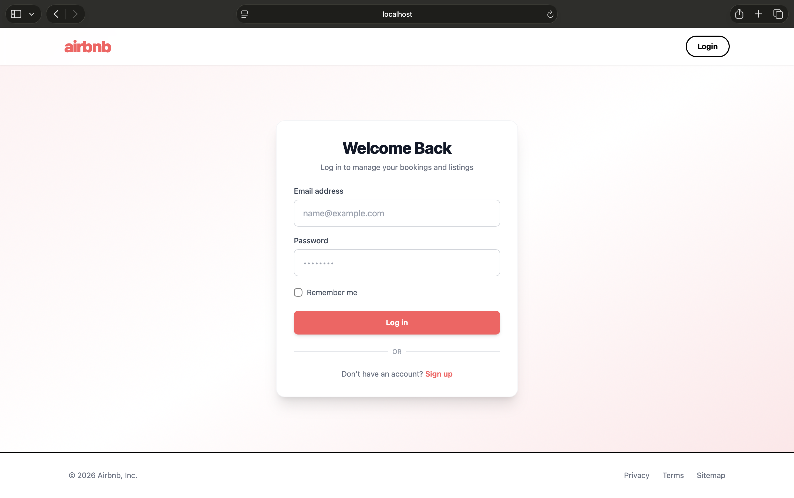

# Airbnb Clone — Backend

A server-rendered Airbnb-style home-sharing application built with Node.js, Express, and MongoDB. Guests can browse and favorite homes; hosts can list, edit, and delete their properties.

## Tech Stack

- **Node.js + Express 5** — server and routing
- **MongoDB + Mongoose 9** — database
- **EJS** — server-side templating
- **Tailwind CSS 4** — styling (`@tailwindcss/cli`)
- **express-session + connect-mongodb-session** — session store
- **bcrypt** — password hashing
- **multer** — image uploads
- **express-validator** — form validation

## Features

- **Auth**: Sign up, log in, log out with validation; "remember me" extends the session to 30 days
- **Roles**: `guest` and `host` user types
- **Guest**: browse homes (`/homes`), view details, add/remove favorites, view bookings page
- **Host**: add a home (`/host/add-home`), list own homes, edit, delete (protected — redirects to `/homes` if not a logged-in host)
- **Uploads**: image-only file uploads via multer, served from `/uploads`

## Screenshots

| Home | Homes | Home details |
| --- | --- | --- |
|  |  |  |

| Favorites / Bookings | Host add-home |
| --- | --- |
|  |  |

## Getting Started

### Prerequisites

- Node.js (18+)
- A MongoDB instance (local or Atlas)

### Installation

```bash
git clone <repo-url>
cd airbnb-Backend
npm install
```

### Environment Variables

Create a `.env` file in the project root:

```env
DB_PATH="mongodb://<your-mongo-uri>/airbnb"
sessionSecret="<your-session-secret>"
PORT=4000
```

> `.env` is gitignored — never commit real credentials.

### Run

```bash
npm start
```

This runs the server (via nodemon) and starts the Tailwind CLI watcher in parallel. Visit `http://localhost:4000`.

## Project Structure

```
controllers/   # auth, host, store, error handlers
models/        # Mongoose models (home, user)
routes/        # store, host, auth routers
views/         # EJS templates (store/, host/, auth/, partials/)
public/        # compiled Tailwind CSS
uploads/       # uploaded home images (gitignored)
utils/         # helpers (pathUtils)
```

## Routes

### Store (public)

| Method | Path                | Description            |
| ------ | ------------------- | ---------------------- |
| GET    | `/`                 | Home page              |
| GET    | `/homes`            | All homes              |
| GET    | `/homes/:homeId`    | Home details           |
| GET    | `/bookings`         | Bookings page          |
| GET    | `/favorite`         | Favorite homes         |
| POST   | `/favorite/add`     | Add home to favorites  |
| POST   | `/favorite/remove`  | Remove from favorites  |

### Host (requires logged-in host)

| Method | Path                       | Description         |
| ------ | -------------------------- | ------------------- |
| GET    | `/host/add-home`           | Add home form       |
| POST   | `/host/add-home`           | Create home         |
| GET    | `/host/host-home-list`     | Host's homes        |
| GET    | `/host/edit-home/:homeId`  | Edit form           |
| POST   | `/host/edit-home/:homeId`  | Update home         |
| POST   | `/host/delete-home/:homeId`| Delete home         |

### Auth

| Method | Path       | Description |
| ------ | ---------- | ----------- |
| GET    | `/login`   | Login form  |
| POST   | `/login`   | Log in      |
| GET    | `/signup`  | Signup form |
| POST   | `/signup`  | Create user |
| POST   | `/logout`  | Log out     |